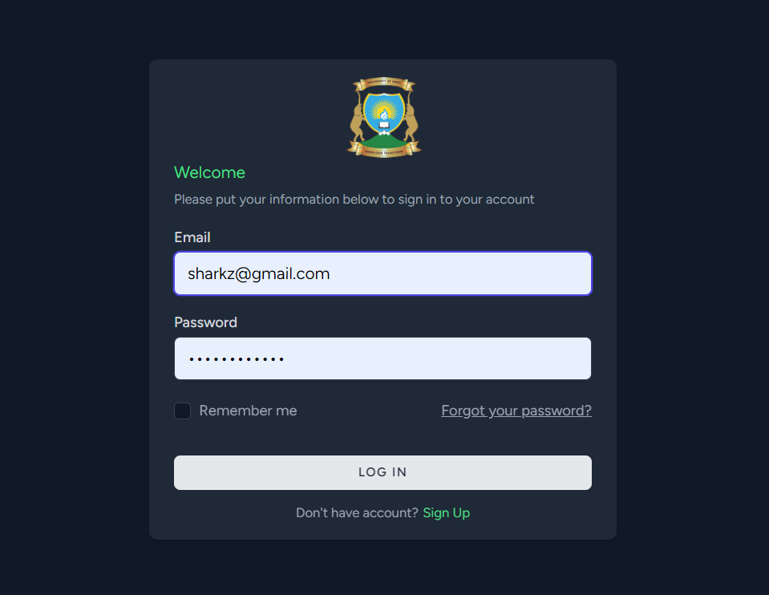
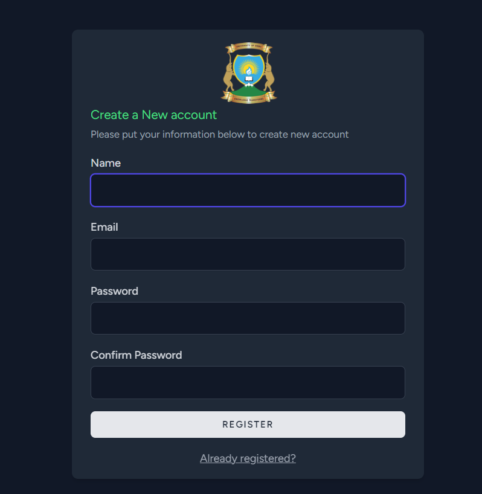
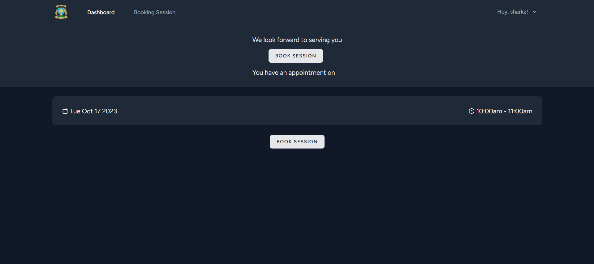
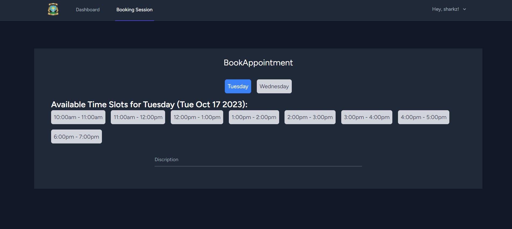

# Automated Therapy Booking for the University of Embu

## Introduction

This project aims to automate the therapy booking process for the University of Embu, making it more efficient and user-friendly.

## Features

- **User Registration**: Users can create accounts to access the booking system and check on progress.
- **Therapist Selection**: Users can choose their preferred therapist based on availability and specialization.
- **Booking Appointments**: Users can schedule therapy sessions at their convenience.
- **Appointment Management**: Users can view, reschedule, or cancel their appointments.
- **Notifications**: Automated reminders for upcoming appointments.

# Login and Register Pages

# Dashboard Page

# Book Session Page

